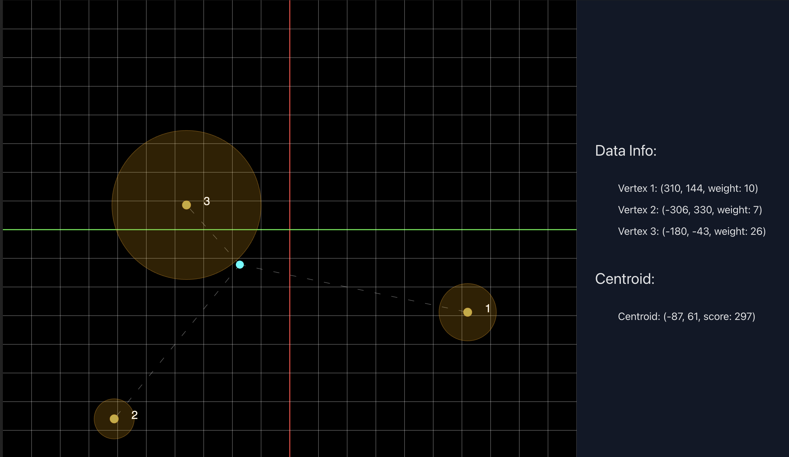
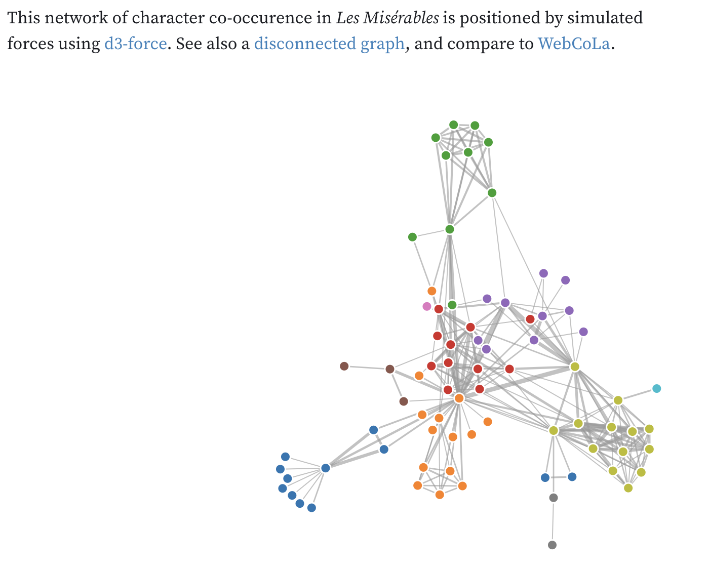

<div align=center>
  <h1> Force Drawn Graphs</h1>
  <h4> What does wikipedia look like in 3D space? </h4>
  
  
  
  
  
</div>

- [Objective](#objective)
- [Background](#background)
- [Technical Info](#technical-info)
- [Problem Solving Starts](#gotta-start-somewhere)
- [Finding Centroids](#finding-centroids)
- [Getting Data](#the-data)
- [Graphs](#a-brief-intermission-to-stumble-onto-graphs)
- [Wikidata API Revist](#the-wikidata-reprise)
- [JUNG Graphs & Layouts](#jung-java-universal-networkgraph-framework)
- [References](#references)
- [System Specs](#system-specs)

### Objective:
Create a tool which can map the relationships (e.g. Hyperlinks) inside of a dataset like Wikipedia to create a 3D galaxy like visualization of the data which can be interacted with and explored in a cool visual way. Learn about working with big data, data analysis, and data visualization. Continue to learn the Java Language, Spring (in its various forms), and all while building something I have always wanted to see.

### Background:
Working with large datasets, and tackling huge problems programatically is tough. When exploring these repositories I find myself wondering a bit more about the entire process of not just the solution, but how the solution was arrived at. Thusly, this projects (and README's...) structure will follow the overall narrative of the entire problem solving process, ignorance in place. Careful attention was made to exploit every opportunity to learn something new, and document it well.

### Technical Info: 
This repository comprises a [Spring Boot](https://spring.io/projects/spring-boot) application leveraging [Spring-Shell](https://spring.io/projects/spring-shell) to test & build out the functionality of a Web API backend - it should be locally cloneable and runnable, but is meant for building and testing and not neccasarily to be used or run by anyone else. 

### Gotta Start Somewhere:
Initially concieved of while using the [p5.js](https://p5js.org/) library, and inspired by their mission of inclusivity and accessibility, I wondered what would Wikipedia look like in 3D space, explorable, how could you use it? Most of us search for a topic, read, and explore related topics through links, what if instead you could just see what was nearby? While building a recreation of a [self playing rock-paper-scissors](https://github.com/horaciovelvetine/rock-paper-scissors), it occurred to me that assuming the initial topic was the center of the universe, linked or related articles could be placed around it basing their positions on how strongly they were related. 

The first step in problem solving is always to solve a simpler problem. It helps if they are related, but you do you.

There are two immediately apparent problems which need simplifying or solving. What does: 'just see what was nearby' mean, and how do you map a bunch of points in 3D space? If users naturally explore links in articles it would make sense to extend this behavior, so the more times two things are linked the closer they should be to each other. The second one, simplify and start with 2D (x,y) coordinates. 

These two changes really do a lot to make the math here extremely approachable, we have a point (0,0), and then add a point for each linked topic an appropriate (random heading/direction) and distance away. Then iterate over the "known universe" (to limit results, wikipedia after all has a LOT of topics) and calculate a best fit average for where each topic/node/vertex should be placed.

It looks something like this:

<div align=center>
  <a href=https://github.com/horaciovelvetine/finding-centroids>
    
  </a>
</div>

### Finding Centroids:
The word "centroid" emerged from some ignorant googling, but led to some more information about calculating the "weighted average", and how it was used. [This repository](https://github.com/horaciovelvetine/finding-centroids) has a deep dive into the code (Javascript), math (just simple averages), and process behind finding a "centroid" for a given set. In short a "centroid" is defined as the point between a set of points which best represents that set. A principle used in statistics known as: ([k-means clustering](https://en.wikipedia.org/wiki/K-means_clustering)), uses these principles for analyzing and creating best fit averages of large sets of data. With some small tweaks this math can be recreated, modified, and called recursively to calculate a best fit to layout the data. It would be as simple as thwoing the points out into the universe, then iterating over them an acceptable number of times to craft a universe. 

### The Data:
Publically available data from [Wikidata](https://www.wikidata.org/) encompasses *ALL* of the known [Wikimedia Universes'](https://www.wikimedia.org/) data. They host and provide a lot of tools for working Wikidata into every concievable kind of project, and in a number of usable formats. But, the sheer enormity of this resource led to exploring alternatives and finding the [Kensho Derived Wikidata Dataset](https://www.kaggle.com/datasets/kenshoresearch/kensho-derived-wikimedia-data/). Hosted on [Kaggle](https://www.kaggle.com/) this dataset appeared to be exactly perfect for this use - a snapshot from 2019 of the English Wikipedia, pre-processed to include hyperlinks and relevant text data, at a manageable size of *(approx.)* 30GB.

<div align=center>
  <h4> Kensho Dataset Table Diagram</h4>
  
</div>

Working with this large of a dataset meant the chance to unpack the different ways to get data into a database. First attempts at reading this data were very straightforward: line by line - parse and insert. Originally the estimated time to complete this process was 2 or more weeks, but reasearch, implementing `PreparedStatements`, `BatchInserts`, and multi-threading had the process completing consistently in under 15 minutes. The [Kensho Derived Wikimedia Dataset Doc](docs/Kensho_Wikimedia_Data.md) has complete timing data and breakdowns for: testing prepared statements, batching, batch sizing comparisons, multi-threading, and walks through each change step by step in detail if you want to read more.

 After some time exploring and optimizing the import process it became clear that this data was not a clean representation of the English Wikipedia. As is often the case the primary source, [Wikidata](https://www.wikidata.org/), was going to be the only and best option. Regardless of the enormity of the resource and complexity to use it, a pivot to Wikidata will be needed.

### A Brief Intermission to Stumble onto Graphs:
While working through the Kensho dataset, and still trying to wrap my head around the cost of this sort of recursive average calculation process I purchased a Chemistry model kit. The intention was to help myself sort of iterate visually and understand my own working Centroid hypothesis, and because I wanted one no (some) shame. The simple idea of a physical model, a galaxy-esque solution, prompted my continued research for an existing solution, and after some more time, researching React data visualization tools I found [an example from the D3.js visualization library](https://observablehq.com/@d3/force-directed-graph/2?intent=fork). This example titled "force-directed-graph" was the jumping off point, the entire duration of this process I knew I wasn't re-inventing the wheel, just lacking the word "round". 

[Graph Theory](https://en.wikipedia.org/wiki/Graph_theory) is the field of math which universally encompases all relationship structured data consisting of vertices (nodes) and edges. An interesting subset of those is [Force Directed Graphs](https://en.wikipedia.org/wiki/Force-directed_graph_drawing). These kind of graphs are, in a lot of ways,  the same solution as the afformentioned model kit: a (simulated) physical(-ish) solution to an understanding problem. Fundamentally weighted averages would absolutely be a valid approach ([a programatic proof](docs/Tutte_Centroid_Layout.md)), the drawbacks of this implementation are in its ignorance to all of the exploration that has been done in this field. For a deeper dive, more references, background, and reading on Graphs see the [Graphs Doc](docs/Graphs_and_JUNG.md).

<div align=center>
  
</div>

### The (Wiki)Data Reprise:
Returning to using [Wikidata](https://www.wikidata.org) as the primary source for data presents some new challenges to tackle. The first of which is a fundamental structural change of *having* vs. *fetching* the data used to calculate the graph. Using the Kensho-set originally provided a manageable (30GB) archive containing a majority of the info needed, allowing for a "local" copy, but was pre-processed to omit a lot of info. Wikidata doesn't provide a ZIP or JSON (of a reasonable size *<100GB-ish*) that can be quickly used without a tremendous increase in the amount of infrastructure required to support the application. This means pivoting to a fetch based approach with a few key differnces and tradeoffs: 

- Primarily, ***Wikidata is not Wikipedia***, while it may host data referenced by Wikipedia, Wikidata is a fundamentally different resource which organizes it's data (and specifically hyperlink data) completely differently. 
- External fetch requests mandate waiting on the API for data, annecdotally this has been **a guarenteed 1- 8(!!) sec. of delay**
- Entity requests to the Wikidata API are limited to 50 entities per (additional speed penalties)
- Fetches can be filtered very strictly to only get the needed data
- Reduced overhead from not having to query or write to a PG databse, combined with the efficency of heap storage & using Java structs

The included [Wikidata Api Doc](docs/Wikidata_Intro.md) contains a thorough walkthrough of implementing the above changes, working with the provided [Java Wikidata Toolkit](https://github.com/Wikidata/Wikidata-Toolkit), and even a [Pull-Request](https://github.com/Wikidata/Wikidata-Toolkit-Examples/pull/6) implemented to update the [Wikidata Toolkit Examples](https://github.com/Wikidata/Wikidata-Toolkit-Examples) with some beginner freindly changes to help understanding some fundamental fetch features built into the toolkit. 

### JUNG (Java Universal Network/Graph Framework):
[JUNG](https://jrtom.github.io/jung/) is a library written by some of the Guava *(Google + Java = Guava, or really Gooava but I'm betting that change wouldn't pass a vote)* team *externally* to seperate out more specific Graph behaviors, algorithms, implementations, and tools, to an open-source library. It's existed in a few incarnations with [a previous version's docs](https://jung.sourceforge.net/) equally findable as the [currently maintained project](https://github.com/jrtom/jung) & [docs](https://jrtom.github.io/jung/javadoc/index.html), and serves as a terrific base to incorporate and build from. 

Since the intention is to present Wikidata in exploreable 3D space there's a bit of work done to unpack how layout algorithims work and then modify them ever so slightly to add just one more dimenstion. The [Graphs Doc](docs/Graphs_and_JUNG.md) outlines this entire process in detail, including testing timings and unpacking each implementation step by step, and the [References Dir](docs/references/) contains any additional reading and context you need.

### References:
There was a significant amount of research put into this project, see: `docs/references/` for some ***COPIES*** of reference material. Throughout this project dead-links meant either significant hunts for source material, or frustratingly loose threads. In order to avoid this, and with all due respect to each and every single individuals work which helped this project, there are COPIES of the documents being used wherever possible. If you would like any of your works removed, references changed, or citations change, please get in touch! 

### System Specs: 
  - 2021 16" MacBook Pro w/ M1 Max, 64GB RAM
  - Postgres v2.7.1
  - Spring 3.2.2
  - VM Details (Some profiling was done which requied using the GraalVM) 
``` shell
java version "22.0.1" 2024-04-16
Java(TM) SE Runtime Environment Oracle GraalVM 22.0.1+8.1 (build 22.0.1+8-jvmci-b01)
Java HotSpot(TM) 64-Bit Server VM Oracle GraalVM 22.0.1+8.1 (build 22.0.1+8-jvmci-b01, mixed mode, sharing)
```