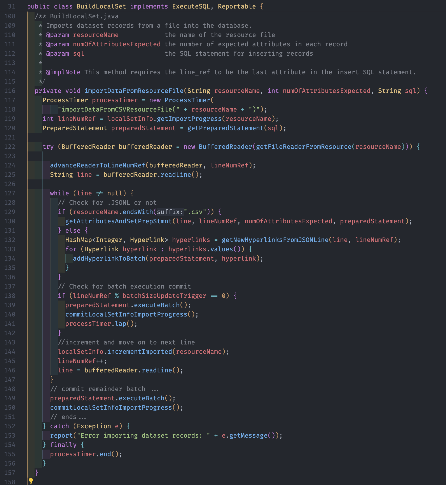

# ForceDrawnGraphs

Original Dataset [here](https://www.kaggle.com/datasets/kenshoresearch/kensho-derived-wikimedia-data)

Goal: analyze the data to create a graph set representation reflection the relative relationship between wikipedia pages.

## Configuration

The dataset linked above is >20GB and requires some time to download, however a local copy is needed in `src/main/resources/data/`. Additional configuration will be required for your preferred local DB, this implements a local Postgres DB to track the graph data.

## Running

This application uses Spring-Shell to provide a CLI interface to run the various commands `help` will list all of the available commands and a summary of what they do

## Resources

- Spring-Shell: [site](https://docs.spring.io/spring-shell/docs/current/reference/htmlsingle/)
- Overview of Spring-Shell: [site](https://reflectoring.io/spring-shell/)
- JUNG: Java Universal Network/Graph Framework: [site](https://jung.sourceforge.net/)

### Module 1 - Creating a local copy of the dataset.

First step is to import the variety of files the dataset provides, including mostly .csv and a .jsonl file. Each file gets a corresponding table. For now aliases will be excluded. The PK ID for each model will be internal to the local PG DB, while the original ID-ing structure will remain stored as ints, this will allow any FK contraints to be mitigated on import.

- [ ] items 
  - id (int)
  - item_id (int)
  - en_label (string)
  - en_description (string)

- [ ] pages 
  - id (int)
  - page_id (int)
  - item_id (int)
  - title (string)
  - views (int)

- [ ] hyperlinks
  - id (int)
  - from_page_id (int)
  - to_page_id (int)
  - count (int)

- [ ] properties
  - id (int)
  - property_id (int)
  - en_label (string)
  - en_description (string)

- [ ] statements
  - id (int)
  - source_item_id (int)
  - edge_property_id (int)
  - target_item_id (int)

#### Optimizing Imports - Testing performance of PreparedStatements

There are more than 141 million statements, and some 60 million additional entries in this (Wikipedia) dataset. Given this volume of data, each call to the DB (to write) will be the most costly part of the process. This write is done using the `PreparedStatement` class [docs](https://docs.oracle.com/en/java/javase/17/docs/api/java.sql/java/sql/PreparedStatement.html), which provides the unique opportunity to dig into the PreparedStatement and see if and how the amount of data included with each commit effects the performance.

Goal: Determine the optimal size of the batch to be included in each commit.

Hypothesis: Given the inclusion of the `executeLargeUpdate()` method [docs](https://docs.oracle.com/en/java/javase/17/docs/api/java.sql/java/sql/PreparedStatement.html#executeLargeUpdate()) I think there will be diminishing returns as the size of the batch is increased, so the limiting factor will be some combination of my hardware limitations. As the number of records increases point the `executeLargeUpdate` method must be required, but I believe this method is intended for running a large update across _all_ rows of a table to adjust something globally (like a timestamp) and not for writing new info to the database. 

Processes: `BuildLocalSet.java` class contains the majority of the code for this module and is initialized with the `build()` command. Each test is run on the same data (item.csv) to compare a variety of batch sizes for each commit. The import process is halted after the `sampleSizeLimit` is reached, and the time taken for the process is recorded. The data was pulled into Excel for analysis and visualization.

Batch sizes were: 100, 1000, 2500, 5000, 10000, 25000, 50000, 100000 objects per commit. Below is a snippet of the main method behind the import process.

Hardware/Software: 
- 2021 16" MacBook Pro
- Apple M1 Max
- 64GB RAM
- Ventura 13.0
- Postgres v2.7.1
- Spring 3.2.2

- All other data has been cleared out of any local Postgres DBs, each test is being run on a fresh DB hosted and connected to locally. 
- No other applications/processes are running on the machine during the tests (within reason, the OS is still running),and all wireless connections are disabled.
- The internal drive is approximately 25% full and is 2.0TB in size. 

Results v1.0:

- On line 80 the commented out block is an if statement to check for divisibility by 10,000 to record a timestamp to track progress - For the larger batch sizes (>10k), this wasn't used. This caused there to be an uneven-ness in the data. The data for these runs is below - but the larger batch sizes (>10k) were excluded from the graph due to this uneven-ness. 
- The data is recorded in [this Excel file.](docs/Optimizing%20Imports%20-%20Prepared%20Statements%20Data.xlsx) and shows a general trend that smaller batch sizes mean more commits, and as the batch size increases this time decreases. However, as predicted it appears that there are diminishing returns. 

v1.1 Adjustments:

Processes: 
- The data will be re-run with new batch sizes focused around the larger batch sizes to better determine how and when diminishing returns begin to occur. The new batch sizes will be: 10,000, 25,000, 50,000, 100,000, 250,000, 500,000, 1,000,000, 10,000,000, and additional 10,000,000 runs with heap size being increased.
- The 'lapping' process will be seperated out to allow for a consistent dataset to be recorded for each run. 

Results v1.1:

Takeaways: An interesting stepping trend becomes apparent as with the increasing batch size, after some reading it's clear the limitation here is my understanding of the inner workings of some of the underlying technologies. These tests once again focused on batch sizes that show a trend of continuing returns, but has been limited to my sample size of 10m objects.  The most performant batch sizes were the 100k, 10m & 10m(a) runs - but the degree of change is only some 3000ms. over the entire sample set. With a variance of about 3 sec. per 10m objects, and a total of approx 210m objects to be imported, instead of continuing to chase the rabbit down the hole optimizing, I'll keep on moving forward.

### Module 2 -  Leveraging Multiple Threads to Import Data

Goal: Demonstrate the difference between single and multi-threaded imports of the dataset. 

Hypothesis: No-brainer here, the multi-threaded import will be faster. The question is how much.

Process: The `BuildLocalSet.java` class has been updated (pretty minimally) to allow importing of each of the 7 files in the dataset. The largest change in this process is the addition of the logic to process the .jsonl file, this file contains all the hyperlinking data & the logic for the process was completed in an earlier stage in this project and re-implemented here. This logic utilizes the JACKSON databind library to read the .jsonl file to some POJO's , which are then processed and committed to the database as `Hyperlink` objects. This process happens inside the `importDataFromResourceFile()` method, called inside from the `build()` command.

For the single-threaded process this method is called once for each of the 7 files in order, and for the multi-threaded process each of these methods is called asynchronously using an `ExecutorService` with a cached thread pool. Otherwise the underlying logic for the process is all the same utilizing all of the helpers inside of the [BuildLocalSet.java](src/main/java/edu/ForceDrawnGraphs/commands/BuildLocalSet.java) class. 

Results: 

- The default batch commit size was set back to 100,000 due to limitations in heap sizing, and taking into account the results from the previous module. 
- The data from Run-2 of the Single-Threaded process was run and without thinking I continued to work in the background (chrome open, and excel, etc...) this caused this run to be noticeably slower than the other single-threaded runs, and was subsequently excluded from analysis.

Takeaways: The multi-threaded process ends up being some 2.2x faster than the single-threaded import. Given the performance uptik, the `counts()` command in [FindAndUpdateRecordCounts.java](src/main/java/edu/ForceDrawnGraphs/commands/FindAndUpdateRecordCounts.java) was refactored to leverage multi-threading as well, to similar effect. When beginning this project my original time to complete an import was estimated to a few days, now that process has been reduced to UNDER 15 minutes - to create a COMPLETE local copy of the entirety of the English Wikipedia (as of 2019 - the origianl date from Wikimedia's dump and the Kensho set).

To give some additional insight - my logic for the import process adds 5ms (on average) of time over the entirety of the import of some 210 million records (across all 7 files). The remaining overhead in the import process is Postgres and the Libraries used to write to it, and had been minimized as much as is reasonable for the scope of this project. 

### Module 3 - Analyzing Data and Building Nodes/Edges

Goal: Create the underlying nodes and edges to run through the JUNG library to create a graph representation of the data.

Unpacking the process: 

- At the end of this command there should be (in two new tables) a complete list of all the nodes and edges in the dataset. 
- The data can be pretty neatly subdivided into two categories: 
  - Nodes: Items, Pages
  - Edges: Statements, Hyperlinks, Properties
- Any edge cannot have a matching source and target node.
- There should be only one edge between any two nodes with a cumalative strength which may represent the number of times the edge is present in the dataset.
- Given the volume of data the trick will be to minimize the number of queries to the database to get the data needed to build the graph.
- The advantage is the nature of the 1 to 1 realtionships can be exploited to abuse the unique constraints for columns on each of the new models and a catch block to update any duplicates with any value that is not present in the intended object. 
- Adopting the language of the JUNG library, the nodes will be the vertices and the edges will be the edges.
- While there will be source and target vertex attributes, the edges are not directional, this is only to provide a means of addressing either end of the edge.

Record Totals:
  - 26,048,882 Items
  - 5,362,173 Pages
  ---------------------- 
  - 105,305,624 Hyperlinks
  - 141,206852 Statements
  - 6,984 Properties

Object Design: 

- PrepVertices (PrepVertex.java):
  - id (int)
  - x (double)
  - y (double)
  - z (double)
  - srcItemId (int)
  - srcPageId (int)
  - label (String) - Page.title || Item.enLabel
  - description (String) - Item.enDescription
  - views (int) - Page.views

- PrepEdges (PrepEdge.java):
  - id (int)
  - srcVertId (int) 
  - tgtVertId (int)
  - weight (int) - Hyperlink.count
  - edgeType (String) - Statement.edge_property_id.(property).enLabel
  - edgeDescription (String) - Statement.edge_property_id.(property).enDescription

- Properties (Property.java):
  - id (int)
  - propertyId (int)
  - label (String)
  - description (String)

Object Notes: 
- Property can probably just be cached and stored in memory since the size of this set will be reasonably small enought to store w/o slowdowns
- Looking up the source records for edges should be a matter of looking for either hyperlinks or statements with the same srcItemId or srcPageId and then getting the corresponding tgtItemId or tgtPageId to get the corresponding vertex id.